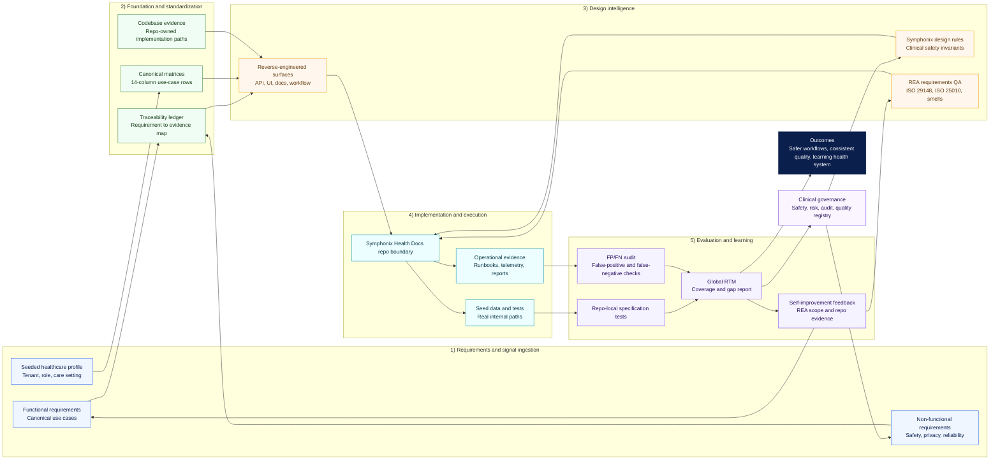
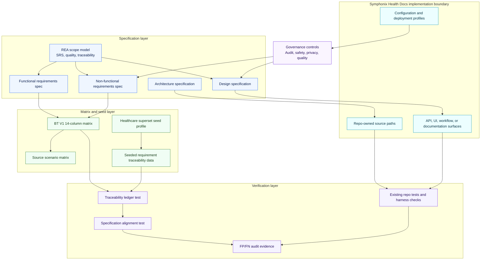

# Architecture specification

Repository: `symphonix-health-docs`.

## Purpose

This architecture specification is reverse-engineered from the repo codebase and aligned to the requirement and use-case evidence. It records the repo boundary, evidence flow, governance controls, REA requirements-quality feedback, and verification paths that support the seeded healthcare platform profile.

## Architecture inputs

- Functional requirements: `docs/specifications/functional-requirements.md` (102 IDs).
- Non-functional requirements: `docs/specifications/non-functional-requirements.md` (21 IDs).
- Design specification: `docs/specifications/design-specification.md`.
- Canonical use-case matrix: `tests/harness/reduced_json_matrices/seeded_alignment_trace.14col.json`.
- Source scenario matrix: `tests/harness/json_matrices/seeded_alignment_trace_scenarios.json`.
- Seed profile: `seed_data/seeded_requirement_traceability.json`.
- Traceability ledger: `seeded_alignment_trace.py`.

## High-level architecture diagram

## Low-level architecture diagram

## Repo boundary

- Package or project name: `symphonix-health-docs`
- Observed surfaces: documentation, seeded_data, workflow_or_matrix.
- Observed frameworks and tools: repo-local implementation.

Observed implementation evidence:
- `brand/showcase.html`
- `seeded_alignment_trace.py`
- `strategy/helixcare-rl-implementation-plan.html`

## Architecture decisions

- Requirements and canonical use cases are treated as the controlling contract for repo behaviour.
- REA requirements QA is treated as part of the self-improvement loop for scope, wording, quality attributes, and traceability.
- The seeded traceability ledger is an evidence map; it does not replace service code or behavioural tests.
- Tenant, role, care-setting, jurisdiction, and integration differences are represented as deployment profiles.
- Clinical governance and quality controls remain visible at both architecture levels.
- Runtime readiness requires real internal routes, data, permissions, and telemetry where the repo owns those services.

## Verification

- Run `python -m pytest tests/test_seeded_alignment_traceability.py tests/test_specification_alignment.py`.
- Where the repo has `tests/test_bullettrain_v1_matrix.py`, run it with the generated tests.
- Run the workspace seeding audit to refresh the global RTM and FP/FN evidence.

## Change control

Architecture changes must update the diagrams, FR/NFR specifications, design specification, canonical matrices, seed evidence, and tests in the same change when they affect requirement behaviour or use-case coverage.
