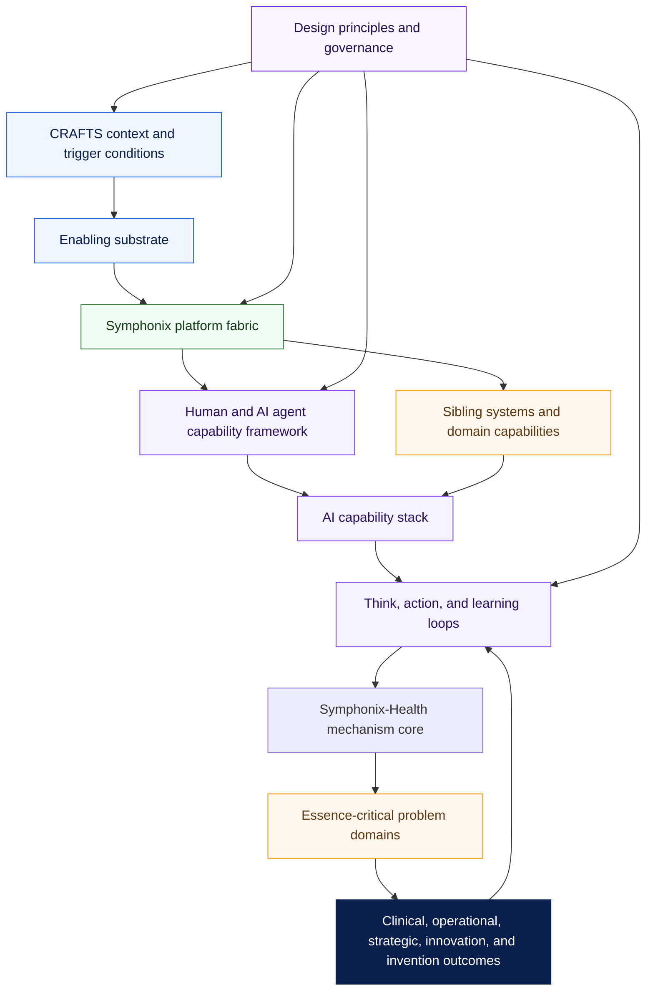
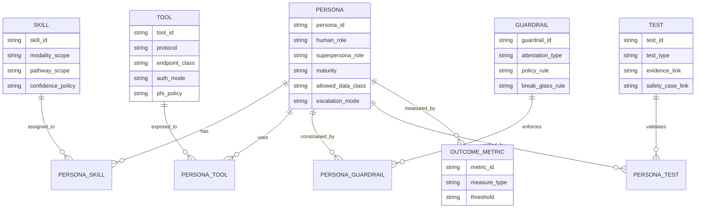

# Symphonix-Health platform high-level architecture

Date: 2026-06-11

Status: workspace-reviewed target architecture for the Symphonix-Health platform that powers HelixCare Global Hospital.

## Purpose

This document is the controlling high-level architecture description for Symphonix-Health. It aligns the nested CRAFTS-based architecture diagram, the supporting documentation, and the observed implementation across the owned workspace repositories.

The architecture should be read as a platform-of-platforms architecture. Symphonix is the platform fabric. Symphonix-Health is the healthcare mechanism built on that fabric. HelixCare Global Hospital is the operating hospital network that consumes the mechanism through clinical, operational, financial, administrative, and assurance workflows.

## Standards basis

| Standard or framework | Use in this architecture package | Source |
| --- | --- | --- |
| ISO/IEC/IEEE 42010:2022 | Architecture description structure: entity of interest, stakeholders, concerns, architecture views, viewpoints, models, correspondence, and rationale. | https://www.iso.org/standard/74393.html and https://standards.ieee.org/ieee/42010/6846/ |
| IEEE/ISO/IEC 29148-2018 | Requirements engineering discipline: stakeholder requirements, system requirements, characteristics of good requirements, attributes, traceability, verification, and iterative requirements work. | https://standards.ieee.org/ieee/29148/6937/ and https://www.iso.org/standard/72089.html |
| TOGAF Standard, 10th Edition | Enterprise architecture framing: Architecture Development Method, architecture content, building blocks, governance, migration planning, and enterprise capability alignment. | https://www.opengroup.org/togaf and https://www.opengroup.org/togaf-standard-10th-edition-downloads |

## Architecture decision

The main document should be a high-level architecture description, not a theory paper and not a component inventory. The detailed CRAFTS, critical-realist, superhuman clinical intelligence, and diagram cross-check documents should be subordinate views.

The high-level architecture document should define:

- the platform boundary and naming convention;
- the CRAFTS context and trigger model;
- the Symphonix platform fabric and its reusable services;
- the Symphonix-Health mechanism core;
- the human and AI agent capability framework;
- the sibling-system and domain capability ring;
- the think loop, action loop, and learning loop;
- the problem domains and outcomes;
- the evidence, governance, and test obligations that decide whether the architecture is implemented.

## Scope

In scope:

- Symphonix-Health as the healthcare platform mechanism.
- HelixCare Global Hospital as the operating healthcare enterprise.
- Owned workspace repositories under `C:\Users\hgeec\github`, excluding forked repositories and duplicate worktrees.
- Human agents, AI agents, personas, superpersonas, skills, tools, clinical frameworks, authority, safety, evidence, and outcomes.
- Domain systems connected through BulletTrain, GHARRA, Nexus A2A, Bridge SDK, Prompt Engine, governed tool services, SignalBox, CSAA, and CAID.

Out of scope:

- Forked upstream repositories used as external references.
- Vendor-specific deployment sizing that is not evidenced in the codebase.
- Claims that all sibling systems are complete until their traceability and real-service gates pass.

## Stakeholders and concerns

| Stakeholder | Main concerns |
| --- | --- |
| Patient, carer, citizen user | Consent, access, understandable outputs, continuity, safe escalation, privacy. |
| Clinician and allied health professional | Longitudinal context, safe reasoning support, delegation, decision evidence, workload reduction. |
| Clinical safety officer | Hazard controls, safety case evidence, escalation thresholds, auditability, post-market monitoring. |
| Hospital operations leader | Throughput, coordination, staffing, scheduling, supplies, reporting, exception handling. |
| Payer, finance, and administration teams | Claims flow, eligibility, reimbursement, fraud controls, traceability, reduced administrative friction. |
| Platform engineer | Interoperability, routing, identity, observability, testability, deployment repeatability. |
| Regulator and assurance reviewer | Requirements traceability, risk controls, data governance, explainable evidence, real-service verification. |
| AI governance owner | Persona authority, tool policy, model use, bounded rationality controls, continuous learning boundaries. |

## Target layer taxonomy

The diagram and all supporting documents should use this taxonomy consistently.

| Layer | Name | Architecture meaning |
| --- | --- | --- |
| 1 | CRAFTS context and trigger conditions | Culture, Relations, Agency, Funding, Technology, and Structure shape which mechanisms can activate. |
| 2 | Enabling substrate | Compute, parallel execution, data fabric, standards, identity, security, and observability make governed intelligence possible. |
| 3 | Symphonix platform fabric | Reusable platform services: BulletTrain, GHARRA, Nexus A2A, Bridge SDK, memory/prompt/tool services, governance, and guardrails. |
| 3a | Sibling systems and domain capabilities | Clinical, administrative, operational, financial, and patient-facing systems that execute domain work. |
| 4 | Persona, superpersona, skills, and tools framework | Human and AI agent capability model binding roles, skills, tools, frameworks, authority, safety, evidence, and outcomes. |
| 5 | AI capability stack | Retrieval, generative reasoning, agentic coordination, multimodal context assembly, and networked clinical intelligence. |
| 6 | Think, action, and learning loops | Sense, reason, plan, act, review, learn, and improve across humans and AI agents. |
| 7 | Symphonix-Health mechanism core | Governed infrastructure for grounded clinical reasoning that reduces fragmentation, cognitive overload, and bounded rationality across the health journey. |
| 8 | Essence-critical problem domains | Navigation and triage, care planning and coordination, summarisation and decision support, claims friction, longitudinal context, and bounded rationality. |
| 9 | Outcomes | Immediate outputs, service outcomes, strategic outcomes, innovation, and invention. |
| 10 | Design principles | Refuse human and existing constraints; start from the essence; aim agents at essence-critical problems first; iterate and scale. |

Naming rule: layer 3 can be `Symphonix platform fabric`; layer 7 must be `Symphonix-Health mechanism core`. The current diagram should not label the healthcare mechanism core as only `Symphonix`.

## Context view

## Business and capability view

Symphonix-Health exists to coordinate healthcare work across fragmented systems, reduce cognitive overload, and turn hospital workflows into governed, evidence-producing services. The updated architecture should make bounded rationality explicit because it is a core clinical and operational failure mode: humans and AI agents act with limited time, limited attention, incomplete evidence, local incentives, and partial context.

The core capability groups are:

- Access and navigation: citizen portal, provider portal, triage API, scheduling gateway, appointment system, ambulance/EMS.
- Longitudinal clinical context: Patient360, GP system, HMIS, ePACC's, clinical pathways, maternity, cancer pathways, screening and recall.
- Diagnostics and medicines: LIS, PACS/RIS, genomics interpretation, EPS, pharmacy system, blood transfusion, PICIS.
- Operations and administration: ERP, supply-chain ERP, insurance eclaims, analytics/BI, MHA administration, mortuary administration.
- Platform fabric: BulletTrain, GHARRA, Nexus A2A, Bridge SDK, Prompt Engine, governed tool services, SignalBox, CSAA, CAID.
- Governance and evidence: real seeded data, canonical matrices, FP/FN audit, SignalBox scenarios, CSAA safety gates, CAID advisory and structured memory.

## Application and service view

| Architecture building block | Workspace implementation evidence | Role in the architecture |
| --- | --- | --- |
| BulletTrain | `BulletTrain` README documents 160+ microservices, FHIR R4, OpenHIE, claims, agentic care, SignalBox, RBAC, HITL, and external orchestration. | Interoperability and event fabric for clinical, claims, patient, pharmacy, LIS, PACS, EMS, and operational routes. |
| GHARRA | `global-agent-registry/src/gharra/core/personas.py` defines a unified 101-persona registry across clinical, nursing, emergency, pharmacy, allied health, administrative, governance, engineering, operations, AI/data, public health, and research roles. The main and v2 persona API projections are covered by integration tests. | Trust, discovery, routing, persona registry, and role capability governance. |
| Nexus A2A | `nexus-a2a-protocol` documents trusted agent identity, AI gateway enforcement, GHARRA route admission, personas, IAM groups, and real BulletTrain EventBus harness use. | Agent-to-agent coordination and route admission. |
| Bridge SDK | `symphonix-bridge-sdk/src/bridge_sdk/superpersona_contract.py` implements superpersona contracts, skill packs, tool bindings, IAM scopes, safety posture, runtime budgets, intuition decisions, GHARRA export, A2A cards, MCP tool policy, SignalBox metadata, and audit evidence. | Integration SDK that binds humans, AI agents, skills, tools, frameworks, governance, and sibling systems. |
| Prompt Engine | `prompt-engine/docs/REQUIREMENTS.md` documents agentic mode, PHI handling, guideline references, structured clinical reasoning, reflection, and clinical safety inference. | Prompt assembly, reasoning templates, clinical/PHI policy, and reflection scaffolding. |
| Tool services | Tool governance is implemented through Bridge SDK tool bindings, GHARRA `persona_coverage.py`, MCP policy export, SignalBox attestation tools, and Prompt Engine policy. The repo named `tool-library` is a separate application with its own matrices and must not be treated as the clinical agent tool registry unless a later conformance check proves that role. | Tool discovery, binding, authorization, and runtime use. |
| SignalBox | `signalbox-mcp` documents persona-aware testing, scenario execution, structured assertions, capability checks, and clinical signal attestation. | Scenario runner, perception-action evidence, UI/backend journey validation, and outcome evidence capture. |
| CSAA | `csaa` documents assurance and control enforcement, clinical safety gates, escalation, hazards, and CI gating. | Clinical safety assurance, hazard controls, and governance enforcement. |
| CAID | `caid-agent` documents strategy selection, learning loop, structured memory, advisory taxonomy, matrix integrity tests, and FP/FN audit support. | Requirements, evidence, advisory, learning, and traceability intelligence. |

## Human and AI agent capability framework

The diagram must show a distinct capability framework between the platform fabric and the AI capability stack. This is the layer that makes the architecture more than a set of integrations.

Each human or AI agent should be represented by a governed capability contract:

- identity: human role, AI agent, service account, tenant, country, facility, and authority scope;
- persona: clinical or operational role, professional boundary, SOPs, domain, and FHIR role code;
- superpersona: augmented AI capability profile with delegated tasks, route salience, runtime budget, and safety posture;
- skills: reusable clinical, administrative, communication, reasoning, coordination, documentation, and learning capabilities;
- tools: APIs, MCP tools, SDK bindings, clinical systems, data systems, prompts, and automation surfaces;
- frameworks: SOAP, SBAR/ISBAR, I-PASS, NEWS2, Manchester Triage, NICE/NHS/WHO pathways, ACMG/AMP, CPIC, claims rules, safety-case methods, and local operating policies where repo-backed;
- governance: IAM scope, policy, approvals, HITL threshold, audit evidence, CSAA risk class, and data-use restrictions;
- outcomes: immediate outputs, service measures, patient safety outcomes, operational measures, innovation, and invention evidence.

Implementation standing: the Bridge SDK and GHARRA have code-backed and tested foundations for this framework. GHARRA now exposes 101 personas with no coverage-validation gaps in the current registry, and the main and v2 persona API tests pass. Bridge SDK superpersona contract and concurrency tests also pass. The remaining gap is not "create a persona registry"; it is to export and validate the ER view over the existing registry, then prove that sibling repos consume the GHARRA coverage map and Bridge SDK contract consistently.

### Logical ER view

The attached CRAFTS mapping document proposes a compact persona registry ER model. In the local workspace this should be documented as a logical view over existing code, not as a new source of truth.

Source-of-truth rule:

- `global-agent-registry/src/gharra/core/personas.py` owns persona definitions.
- `global-agent-registry/src/gharra/core/persona_coverage.py` owns platform functions, sibling role bindings, skills, required tools, SignalBox flags, and coverage validation.
- `symphonix-bridge-sdk/src/bridge_sdk/superpersona_contract.py` owns the interoperable superpersona contract shape.
- New YAML or JSON artifacts for personas, skills, tools, guardrails, tests, outcome metrics, or maturity should be generated projections or schemas over those sources unless an ADR explicitly moves ownership.

The ER view is complete only when each entity can be exported or validated from the existing implementation and when every relationship has a direct test or documented non-runtime waiver.

## Data and interoperability view

Symphonix-Health should treat data interoperability as both a substrate and a runtime governance problem.

Required data and exchange surfaces:

- FHIR R4 resources for patient, appointment, service request, observation, medication, diagnostic, and care coordination flows where applicable.
- OpenHIE-style integration patterns for health information exchange.
- Claims exchange for payer workflows, including X12-style claims surfaces where the repo owns them.
- Laboratory, imaging, pharmacy, scheduling, EMS, ERP, supply-chain, patient portal, and provider portal routes through BulletTrain and Bridge SDK rather than unmanaged peer-to-peer calls.
- Persona-aware authorization and route admission through GHARRA and Nexus.
- Real seeded data and scenario evidence for readiness claims.

## Technology and runtime view

The enabling substrate should cover:

- resource governance for compute, concurrency, task budgets, and runtime parallelism;
- data fabric services for source normalization, longitudinal context, and traceability;
- standards and interoperability services;
- identity, security, and tenant boundary controls;
- observability for logs, metrics, traces, audit events, scenario evidence, and outcome evidence;
- CI gates for canonical matrices, seeded alignment, FP/FN audit, and real-service integration.

The codebase currently shows strong component-level evidence for Bridge SDK, Prompt Engine, CSAA, SignalBox, BulletTrain, GHARRA, Nexus, and focused CAID traceability paths. Recent direct checks passed for Bridge SDK superpersona/concurrency tests, Prompt Engine inference and engine tests, CSAA hazard and CLI tests, GHARRA main and v2 persona API tests, workspace inventory tests, and focused CAID seeded-alignment/integrity tests. Estate-wide runtime proof is incomplete until the workspace matrix, maturity, sibling conformance, and closed learning-loop gates pass. A full CAID test run timed out in this pass, so it is not counted as full-suite evidence.

## Security, safety, and governance view

Safety and governance are not optional cross-cutting concerns. They are part of the mechanism core.

Required controls:

- CSAA hazard and clinical safety gates for high-risk workflows.
- GHARRA persona, route, IAM, and role governance.
- Nexus route admission for trusted agent-to-agent calls.
- Bridge SDK superpersona safety posture, runtime budget policy, and audit export.
- Prompt Engine PHI/clinical-policy inference, citation, and reflection scaffolding.
- SignalBox scenario evidence and capability assertions.
- CAID FP/FN audit, requirements traceability, and structured memory.
- Human review and escalation for legally, clinically, or operationally high-risk decisions.

## Learning and improvement loop

The learning loop should be explicitly drawn and documented. It is not only a model-improvement loop; it is an institutional learning loop.

Target loop:

1. Sense and assemble context from patient, operational, and system signals.
2. Select the persona, superpersona, tools, and clinical or operational framework.
3. Reason, plan, and identify uncertainty, missing evidence, salience, and safety class.
4. Act through governed tools and sibling-system routes.
5. Review outcome evidence, exceptions, audit events, safety events, and user feedback.
6. Update scenario evidence, risk controls, prompt and tool policy, route salience, runtime budgets, and persona/superpersona contracts.
7. Feed learning back into requirements, tests, architecture decisions, and service design.

Current implementation is distributed across SignalBox, CAID, Prompt Engine, Bridge SDK, CSAA, and sibling tests. The architecture should not claim a fully closed clinical learning service until this loop is proven across representative real workflows.

## Essence-critical problem domains

The diagram should use this list:

- Navigation and triage.
- Care planning and coordination.
- Summarisation and decision support.
- Claims and administrative friction.
- Longitudinal patient context.
- Bounded rationality.

Bounded rationality is required because the platform is not only solving information fragmentation. It is also changing how humans and AI agents decide under constraints, uncertainty, time pressure, and institutional friction.

## Outcomes

| Outcome type | Expected evidence |
| --- | --- |
| Immediate outputs | Summaries, alerts, referrals, orders, reconciliations, claims, authorisations, route decisions, and audit records. |
| Service outcomes | Lower fragmentation, better traceability, reduced cognitive load, safer coordination, faster workflows, fewer avoidable handoffs. |
| Strategic outcomes | Grounded clinical reasoning, superhuman clinical support bounded by governance, compounding institutional intelligence, better outcomes and efficiency. |
| Innovation and invention | New workflows, new care models, new agentic operating patterns, reusable clinical intelligence assets, and evidence-backed platform capabilities. |

Innovation and invention must be measured through artifacts, adoption, safety evidence, workflow impact, and reusable platform capability. They should not be claimed from diagram text alone.

## Current implementation standing

| Area | Standing | Evidence summary |
| --- | --- | --- |
| Platform fabric | Strong partial implementation | BulletTrain, GHARRA, Nexus, Bridge SDK, Prompt Engine, CSAA, SignalBox, and CAID exist. Focused component tests now pass for the most relevant fabric and evidence services, but cross-sibling integration proof is still uneven. |
| Persona/superpersona framework | Code-backed and tested core, platform-wide proof incomplete | GHARRA now exposes 101 personas and passes main/v2 persona API coverage tests. Bridge SDK passes superpersona contract tests. Sibling consumption and ER-view export still need conformance gates. |
| Sibling/domain systems | Implemented but unevenly proven | Domain repos exist for the visible sibling ring and many additional capabilities; matrix gates currently fail in many repos. |
| Think/action loop | Distributed implementation | SignalBox, CAID, Prompt Engine, Bridge SDK, and CSAA each cover parts; a cross-platform loop gate is missing. |
| Learning loop | Partial | Reflection, memory, prompt policy, scenario evidence, and contract metadata exist, but outcome-fed updates are not yet proven across major workflows. |
| Documentation alignment | Partial | The revised diagram adds missing layers and this high-level architecture controls the taxonomy. Repo-local architecture pointers and an evidence index remain incomplete. |
| Test alignment | Partly repaired, still failing at workspace gate | Representative component tests pass and focused CAID seeded-alignment/integrity tests pass. The workspace-wide canonical matrix/integrity loop still has many open repo failures, and the full CAID suite timed out. |

## Documentation package

To align the diagram with supporting documentation, produce the following package.

| Document | Standard framing | Required content |
| --- | --- | --- |
| Architecture vision | TOGAF Architecture Vision | Problem, scope, stakeholders, value, constraints, principles, target-state summary. |
| High-level architecture description | ISO/IEC/IEEE 42010 | Entity of interest, stakeholders, concerns, viewpoints, views, models, correspondences, rationale. |
| System requirements specification | IEEE/ISO/IEC 29148 | Functional and non-functional requirements, requirement quality attributes, acceptance criteria, traceability. |
| Architecture requirements specification | TOGAF ADM | Architecture drivers, constraints, assumptions, target capability requirements, gap register. |
| Application architecture | TOGAF application domain | Platform services, sibling systems, APIs, agent routes, interface catalog, ownership boundaries. |
| Data architecture | TOGAF data domain | FHIR/OpenHIE/claims/diagnostics/pharmacy/operational data flows, master data, lineage, retention, privacy. |
| Technology architecture | TOGAF technology domain | Runtime, deployment, identity, observability, gateways, SDKs, queues, CI gates. |
| Security and safety architecture | 42010 safety/governance viewpoint | CSAA, IAM, HITL, audit, policy, tenant boundaries, hazards, escalation, safety case. |
| Human and AI agent capability architecture | 42010 custom viewpoint | Persona, superpersona, skills, tools, frameworks, authority, outcome binding, learning obligations. |
| Evidence and verification strategy | IEEE/ISO/IEC 29148 verification traceability | Canonical matrices, seeded data, real-service integration tests, SignalBox scenarios, FP/FN audit, readiness rules. |
| Architecture roadmap | TOGAF migration planning | Work packages, dependencies, transition states, acceptance gates. |

## Diagram and documentation consistency rules

1. Every diagram box must have a corresponding section in the high-level architecture document.
2. Every high-level architecture layer must point to at least one repo, requirement set, evidence artifact, or governance rationale.
3. Sibling systems must be shown as domain capabilities connected through the platform fabric, not as isolated applications.
4. Persona, superpersona, skills, tools, and frameworks must be a first-class layer.
5. Bounded rationality must be listed under essence-critical problem domains.
6. Innovation and invention must be listed under strategic outcomes with evidence obligations.
7. Claims of implementation must distinguish code-backed, tested, partially tested, and undocumented.
8. Readiness evidence must use real seeded internal services, not internal mocks or stand-ins.
9. Matrix and traceability failures must remain open gaps until the failing gates pass.

## Architecture verdict

The implementation stands up to the revised architecture as a strong partial platform. The core fabric and agent capability foundations are real, and the persona/superpersona layer is now materially stronger than the original diagram review suggested. The weakest areas are workspace-wide traceability, sibling conformance, ER-view export, and an end-to-end learning loop that updates the platform from real outcomes.

The strongest target architecture is therefore not a claim that Symphonix-Health is complete. It is a governed platform architecture with explicit evidence gates: the diagram expresses the target mechanism, the high-level architecture describes the views and building blocks, the IEEE 29148 requirements package records verifiable obligations, and the TOGAF roadmap closes the implementation and documentation gaps.
